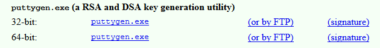

This document contains a step-by-step tutorial to setting up your computer to use the CoEDL Knowledge Base (CoEDL-KB).

<!--more-->

## 1. SSH key generation

To enable password-less logins, we will authenticate sending/receiving data to CoEDL-KB through the Secure Shell (SSH) protocol.

### Mac

To generate a new SSH key pair on OS X:

1. open up the `Terminal` app and enter the following command (replacing `first.last@university.edu.au` with your e-mail):

    ```
    ssh-keygen -t rsa -C "first.last@university.edu.au" -b 4096
    ```
2. You will then be asked where you'd like to save the key. Hit `Enter/Return` to leave this as the default place (`/Users/your-username/.ssh/id_rsa`). 

3. Enter a passphrase (minimum 5 characters) which you will be asked for anytime when interacting with the generated key, and hit `Enter/Return`.

4. To copy the public key (assuming you saved it in the default place), run the command:

    ```
    pbcopy < ~/.ssh/id_rsa.pub
    ```

    You will need the copied key for the next step (configuring GitLab).

### Windows

1. Download `puttygen.exe` from [http://www.chiark.greenend.org.uk/~sgtatham/putty/latest.html](http://www.chiark.greenend.org.uk/~sgtatham/putty/latest.html) (get the 64-bit version, unless you are using a very old Windows machine)

    

2. Open `puttygen.exe`
3. From the top menu item `Key`, make sure `SSH-2 RSA` is selected. 
3. In the bottom-right corner, enter `4096` for the `Number of bits in generated key`.
3. Click `Generate` and, in order to provide randomness to the generator, move your mouse around randomly in the space provided.
4. Once generated, enter a `Key passphrase` which is used to authenticate access to the private key in future.
5. Save the private key in your home directory (e.g. `C:\Users\your-name`, or `C:\Users\your-user-id`). This is the folder that *contains* the `Documents` and `Downloads` folders.
6. Save the public key in the same directory.
7. Copy the ***whole*** public key that was generated in the Key area `'ssh-rsa ...'`. You will need the copied key for the next step (configuring GitLab).

## 2. Accounts to create/configure

1. **GitLab**. As the CoEDL-KB is hosted on GitLab, to contribute to it, you will need a GitLab account [https://gitlab.com/users/sign_in](https://gitlab.com/users/sign_in) (click the `Register` tab, and not the `Sign in` one).

    1.1 Once you've created your account, you can add the generated SSH key in your GitLab profile settings: [https://gitlab.com/profile/keys](https://gitlab.com/profile/keys). Paste the public key into the text area provided, and give the key a title which identifies the specific machine, e.g. `nay-work-mac` or `john-home-macbook-pro`.


- **Atlassian**. To use SourceTree, you will need to sign up for an Atlassian account at [https://id.atlassian.com/signup](https://id.atlassian.com/signup)


## 3. Software to download/install

Download and install the following software:

1. SourceTree from [https://www.sourcetreeapp.com/](https://www.sourcetreeapp.com/)

    1.1 If/when SourceTree says that it cannot find an installation of Git, click the option to install an `Embedded version of Git`

2. Microsoft Visual Studio Code (VS Code) from [https://code.visualstudio.com/](https://code.visualstudio.com/)
   - If you do not have administrator/install access on your Windows machine, you should get the .zip file version of VS Code from [https://code.visualstudio.com/docs/?dv=winzip](https://code.visualstudio.com/docs/?dv=winzip)

## 4. Ask for access to CoEDL-KB

E-mail one of the administrators [nay.san@anu.edu.au](mailto:nay.san@anu.edu.au) with your GitLab username asking for access to CoEDL-KB.

## 5. Create a folder to store Git repositories

**You should make sure that the folder in which your git repositories are stored has no spaces in the file path**. The easiest way to gaurantee this is to create a new folder, e.g. `git-repos`, as close as possible to a top folder (that you have access to). Some examples of paths are:

```
# Windows
C:\git-repos

# Mac/Linux
/git-repos
```

If you do decide to create the folder elsewhere, just double check that there are no spaces within the file path (Windows: right click folder > `Properties` > `Location`; Mac: right click folder > `Get Info` > `Where`).

## 6. Clone CoEDL-KB from GitLab

1. Open SourceTree and go to `File -> Clone/New... ` (Windows) or `File -> New/Clone -> Clone from URL` (Mac)
2. In the `Source Path / URL` (Windows) or `Source URL` (Mac), enter the following address:

    ```
    git@gitlab.com:coedl/knowledge.git
    ```

3. For the `Destination Path`, browse to the `git-repos` folder you created in `Step 5`, create a new folder called `coedl-kb` (or something else if you prefer, but remember no spaces!), and select this folder.

4. You can enter a `Name` that is different from the folder name in the field below (e.g. `CoEDL Knowledge Base` while the folder is `~/git-repos/coedl-kb`).

## 7. Launch CoEDL-KB

### Mac

Click on the `_osx-kb-serve.command` file to serve the Knowledge Base from the browser (`http://localhost:1313`), which should open automatically.

### Windows

Click on the `_windows-kb-serve.bat` file to serve the Knowledge Base. You will need to then open up your default browser (e.g. Chrome, Firefox; Internet Explorer is not recommended) and browse to [http://localhost:1313](http://localhost:1313).

