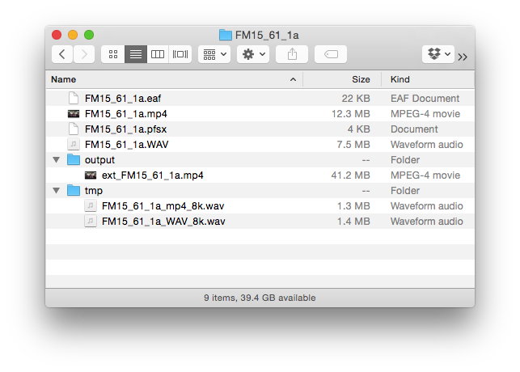
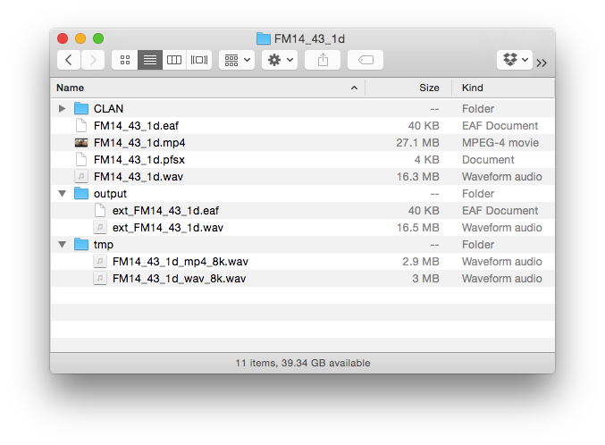

# Automatic alignment of audio and video

author: Sasha Wilmoth, Ola Olsson
date: 2017-05-09

tags:
    - CLAN
    - ELAN
    - Python
    - Docker

categories:
    - Scripts
    - Tutorials

## Introduction

av_align.py is a Python script designed to solve the problem of unaligned audio and video recordings of the same session. It calculates the most likely offset between two media files, and pads them accordingly. It also adjusts the timestamps of an ELAN or CLAN transcript if necessary.

The script runs on Windows/Mac/Linux. We've created a Docker<sup>1</sup> container so there's minimal setup.

### Input

The input is a directory containing:

* Video: mov or mp4
* Audio: wav or mp3
* Transcript: eaf or cha
   * If there's no transcript, the media files will simply be padded to match each other.

### Output
If the audio starts before the video, the script will output an extended version of the video, with grey frames at the beginning. A temporary folder is also created containing the audio files used by the script.


If the video starts before the audio, the script will output an extended version of the audio, with silence at the beginning, as well as a time-adjusted transcript. **The transcript is assumed to be time-aligned to the audio file.**



### Options

You can run the script with the following options:

* `[-h]` Help message
* `[-t TMPDIR]` Location of temporary audio files. Default is `./tmp`.
* `[-d INPUTDIR]` Input directory. Default is `.` (current directory).
* `[-f FFMPEGPATH]` av_align.py uses [FFmpeg](https://ffmpeg.org/) to extract and pad the media files. FFmpeg is included in the Docker container, so this option isn't necessary unless you're running av_align.py on your own system, and FFmpeg is not on your system path.
* `[-v]` Verbose - for troubleshooting.

## Instructions
1. Download and install Docker [here](http://docker.com/).
2. Move to the directory with your data and run the script:

   ```
cd /path/to/your/corpus/
docker run --rm -v $(pwd):/to_align coedl/av_align python /av_align.py -d /to_align/Session001
   ```
`$(pwd)` means present working directory, `/to_align` is what your corpus will be called when mounted onto the image.

You can see these steps in action here:

[](https://asciinema.org/a/2zlbj2jpk3bfvvvbgkgihigul)

If you're not a techy person and need some help setting up your workflow, feel free to [email me](mailto:swilmoth@appen.com).

# Limitations

* av_align.py does not take into account **time stretch**. If one of your media files is stretched relative to the other, it will find an average offset.
* At this stage, the script assumes you only have **one audio file and one video file**. It doesn't work if you're comparing audio + audio, video + video, or more than two files.
* When adjusting timestamps, it is assumed that these are in milliseconds. If you have set your annotations in ELAN to align with frames, proceed with caution.
* The script loads both wave forms into memory. This shouldn't be a problem unless you're working with very long recordings (hours).

## Acknowledgements
av_align.py was written by Ola Olsson and tested by Sasha Wilmoth, on data collected by Felicity Meakins. Thanks to Nay San for setting up the Docker image.


<sup>1</sup> Wait, what's Docker? If you need a metaphor: the Docker container (or image) is like a tiny computer that only runs av_align.py, and you're plugging in your corpus like a USB stick. 
