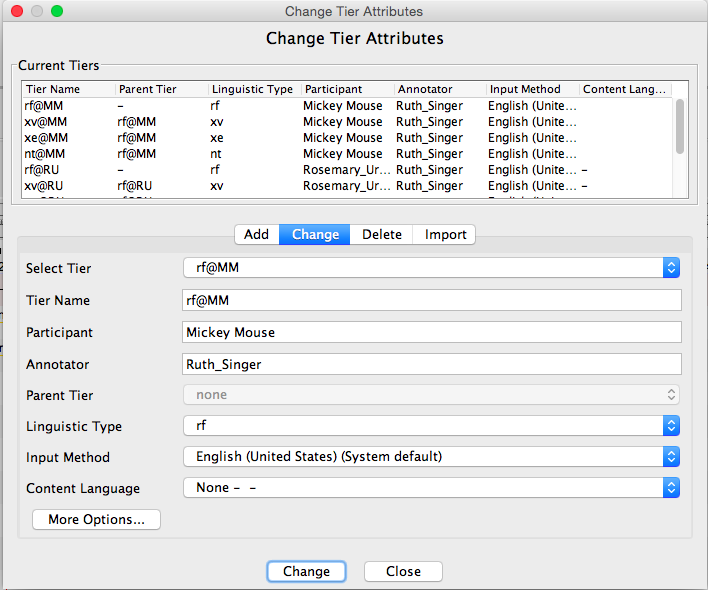

# Introduction

If you use speaker's initials in tier names in ELAN, you might need to update them occasionally. You can do this manually in ELAN by clicking Tier > Change Tier Attributes, and then typing in the new initials for every single tier.

If that's too time-consuming, you can use **changeSpeakerInitials.py**. This is a simple Python script I wrote for Ruth Singer. Ruth had multiple participants in her corpus with the same initials - let's call them Mickey Mouse (MM) and Minnie Mouse (MM).

The tiers look something like this:



# changeSpeakerInitials.py
## Requirements
changeSpeakerInitials.py works with Python 2.7. It works on Mac, and has not been tested on Windows.

The script can be found [here](https://gitlab.com/swilmoth/changeSpeakerInitials.py).

## Instructions

Instead of manually changing each tier in each file to MM1 and MM2, we can make a two-column (tab-delimited) file like this:

New Initials | Name
--- | ---
MM1 | Mickey Mouse
MM2 | Minnie Mouse

The command is:

```
changeSpeakerInitials.py [-h] Speaker_initials.txt /path/to/your/corpus
```

The script looks at who the participants are in each file, and changes the initials in the tier name according to the speaker database. So 'rf@MM' becomes either 'rf@MM1' or 'rf@MM2'.

Any updated ELAN files are put into a new directory called UpdatedInitials.

The script also prints an error message if it finds any names not in the speaker/initial file, as well as the file(s) that each name was found in.

**Note:** The script finds the initials to replace by looking for capital letters or numbers following an @ symbol in the tier name.
