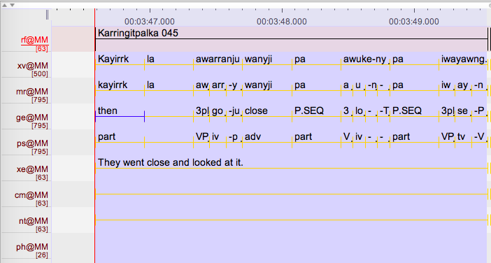
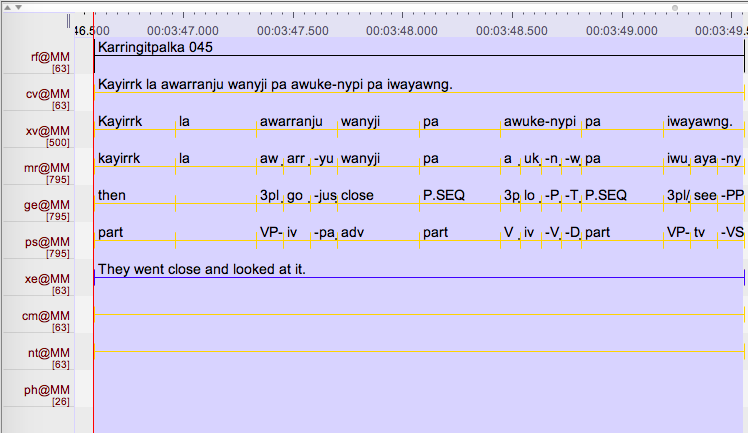

# Adding missing CV tier in ELAN

author: Sasha Wilmoth
date: 2017-08-24

tags:
    - Elan
    - Python

categories:
    - Tutorials

## Introduction

Until the recent release of [ELAN 5.0](https://tla.mpi.nl/tools/tla-tools/elan/download/), it was not possible to automatically parse and gloss transcriptions in ELAN. A commonly used workaround is to export from ELAN into Toolbox, and import the interlinearised texts back into ELAN. In the process, some tiers might be altered.

Ruth Singer sent me some files that had all been nicely glossed, but, as you can see in the screenshot below, the utterance has been tokenised into single words in the XV tier.



I wrote a script in Python that adds the original utterance back in for each participant, based on the words in the XV tier. The output looks like this:



## addCVtier.py

### Requirements

addCVtier.py requires Python 2.x. It works on a Mac, and has not been tested on Windows.

The script can be found [here](https://gitlab.com/swilmoth/addCVtier.py).

### Running the script

The script runs on a single .eaf file at a time, and outputs a new file with the extension `_CV.eaf`. The command is simply:

```
addCVtier.py File001.eaf
```
