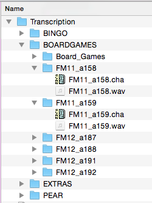
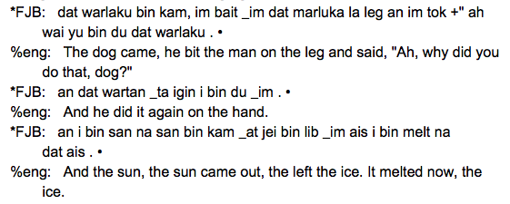

---
# Finding and correcting spelling in CHAT files
author: Sasha Wilmoth
date: 2017-08-29
tags:
    - Tutorial
    - Spelling standardisation
    - CLAN
    - CHAT
    - Gurindji Kriol
    - Python
categories:
    - Scripts
---

## Introduction
The Gurindji Kriol corpus is glossed using the MOR command in CLAN, which looks up each token in the transcription tier, and adds a mor-code from the lexicon accordingly. In order to have a squeaky clean mor-tier, we need to ensure that each token is accounted for, and there are no typos in the transcription or new words to be added to the lexicon. At this stage, we can also fix any known misanalyses of common words or sequences (for example, *dat tu* should be *dat _tu*, as *_tu* is a dual suffix and not a numeral in this context).

I have written two scripts to automate this process: one finds unknown tokens in the transcription tier and outputs a two-column file, the other corrects all CHAT files in a particular directory according to said two-column file.

The two-column checked words file is **cumulative** - once you correct a typo once, you should keep this file and use this valuable information next time you're coding new data.

The process is also **iterative**. You should always double check the corpus with the first script after running the second, to make sure you've caught everything.

## Instructions
## Requirements
Both scripts require Python 2.x. They work on Mac and have not been tested on Windows.

The scripts can be found [here](https://gitlab.com/swilmoth/CLAN-Scripts).

## findUnknownTokens.py
### Input
#### Lexicon(s)

The script allows you to have more than one lexicon - we use two for Gurindji Kriol, as it is a mixed language. They look like this:

```
@UTF8
_a {[scat case:loc]} "_ta&g" =LOC=
_ja {[scat case:loc]} "_ta&g" =LOC=
_jawung {[scat der:having]} "_jawung&g" =PROP=
_ji {[scat case:erg]} "_tu&g" =ERG=
_jirri {[scat case:all]} "_jirri&g" =ALL=
_ju {[scat case:erg]} "_tu&g" =ERG=
...
```
```
...
yutu {[scat pro]} "yundubala&2DU&k" =you_two=
yutubala {[scat pro]} "yundubala&2DU&k" =you_two=
yuu {[scat interj]} "yu&k" =yes=
yuwai {[scat interj]} "yuwai&k" =yes=
zebra {[scat n:animal]} "zebra&k" =zebra=
```
Don't worry if your syntax is slightly different - the script only looks at everything before the first space.

#### Checked words file
I started with a basic 'checked words' file that looked like this:

| Error | Correction |
|---|---|
| dat tu | dat _tu |
| boy | boi |
| shoulda | sholda |
| kangkaru | kengkaru |

This is a tab-delimited plaintext file, with incorrect strings in the first column, and corrections in the second column. The strings can contain **up to 2 tokens**. (Let me know if you would like support for longer strings)

I'm using a checked words file because I know about these errors already, and I don't need the script to tell me about them again. You can also run the script without a checked words file. This is handy if you're checking your data for the first time, or if you're doing a final check after correcting everything (and all of these errors should be cleaned up already).

#### Directory
findUnknownTokens.py will look at any file ending with .cha, in all subdirectories within the given directory. The Gurindji Kriol corpus is structured like so:



The script only looks on the transcription tier, which begins with an asterisk, and may carry on over the next line, like this:




### Command

With those inputs, the command I use is:

```
findUnknownTokens.py -l lex_gurindji.cut lex_kriolgen.cut -c checkedwords.txt -d /path/to/Transcription/folder > output.txt
```
The different arguments are:

```
-h	Help
	If you use this option, the script doesn't run, it just prints a short help message
-l	Lexicon
	At least one lexicon must be provided
-c	Checked words file
	This is an optional argument, if you would like to ignore previously-identified errors in the output file. No more than one checked words file can be provided.
-d	Directory
	The path to the directory containing .cha files
```
### Output

Using the above command gives me an output file with over 200 unidentified tokens. It looks something like this:

| Unknown token | For correction|
|---|---|
| _rayinyj | _rayinyj |
| ppuntanup | ppuntanup |
| -aran | -aran |
| xx | xx |
| playing | playing |
| footy | footy |
| kajirrii | kajirrii |
| lajamanu | lajamanu |
| writing | writing |
| _waija | _waija |
| ayglas | ayglas |
| \_bat\_karra | \_bat\_karra |
| wood | wood |
| marlaku | marlaku |
| ...| |

At the bottom of the file, it also says:

**=== The following tokens are already in the 'checked words' file.===**

**===They will be corrected if you run correctCHATSpelling.py. ===**

| Token | Correction |
|---|---|
| kangkaru | kengkaru |
| shoulda | sholda |

When we go through this file, we have three options:

- For tokens we want to correct automatically, we can do so in the second column and include it in the checked words file.
- We might need to check some things in context. If we fix them all, we should remove this line from the checked words file.
- There might be some new words to add to the lexicon. We should do so, and them remove them from the checked words file.

For example:

| Unknown token | For correction| |
|---|---|---|
| _rayinyj | _ranyj | |
| ppuntanup | puntanup | |
| -aran | _aran | |
| xx | xxx | |
| playing | plei _ing | |
| ~~footy~~ | ~~footy~~ | (This wasn't in the lexicon, so I'll add it) |
| kajirrii | kajirri | |
| lajamanu | Lajamanu | |
| writing | rait _ing | |
| _waija | _walija | |
| ayglas | eyeglas | |
| \_bat\_karra | \_bat \_karra | |
| wood | wud | |
| ~~marlaku~~ | ~~marlaku~~ | (This could be *warlaku* 'dog' or *marluka* 'man' - I'll have to check them in context and remove this line from the checked words file) |
| ...| | |

When I've gone through the full list, I'll add these to my previous checked words file (the one with *boy* and *kangkaru*). This then becomes the input for the next script, and is very valuable information to have next time you're cleaning up your corpus.

Before you proceed, I would recommend running the script again with the updated checked words file and lexicon, to see if there's anything you missed.

## correctCHATSpelling.py
This script only needs a checked words file and a directory containing .cha files. The command is:

```
correctCHATSpelling.py -c checked-words-file -d directory
```

You don't need to specify the output, as it makes new files in the same directory as the original files, with the extension `.cha.corrected`. Check through your files and make sure things have been corrected properly. When you're ready, you can rename the corrected files with a command like this (be warned: this will replace your original files if you haven't made a copy elsewhere):

```
for file in */*/*.cha.corrected; do mv "$file" "`basename "$file" .cha.corrected`.cha"; done
```

This is looking for the corrected files in two nested subdirectories, and would be run from the 'Transcription' directory in the above screenshot.

## Conventions
Please note that these scripts were developed for the Gurindji Kriol corpus, and as such take into account some specific conventions that may not apply to your data.


findUnknownTokens.py will not report some tokens:

- Commas, full stops, exclamation marks, and question marks are not reported in the output. The direct speech marker *+"* is also not reported.
- Commas are stripped from the tokens before looking them up in the lexicon.
- Tokens beginning with capital letters [A-Z] are ignored, as these are automatically coded as proper nouns and do not need to be in the lexicon.
- Tokens beginning with an ampersand are ignored, as these are foreign words.
- *xxx* (representing unintelligible speech) is ignored.

correctCHATSpelling.py will:

- Add a space before a full stop, exclamation mark and question mark, if one doesn't already exist.
- Remove a space before a comma.


## Notes
All the Gurindji Kriol data shown has been recorded by Felicity Meakins and Cassandra Algy.

If you need help with this process or would like to request any changes (such as support for ELAN), please [get in touch](mailto:swilmoth@appen.com) and I'll be happy to help.
