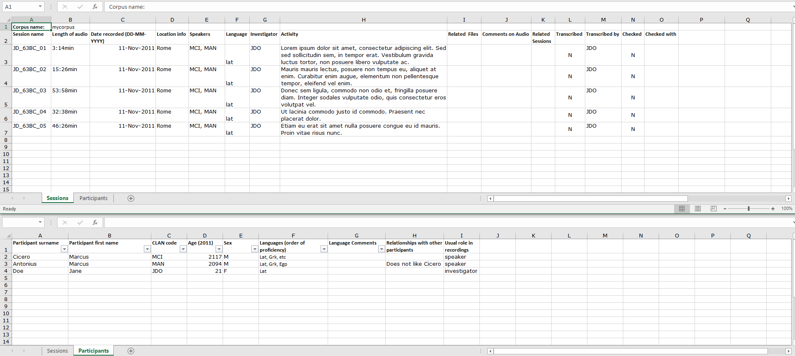
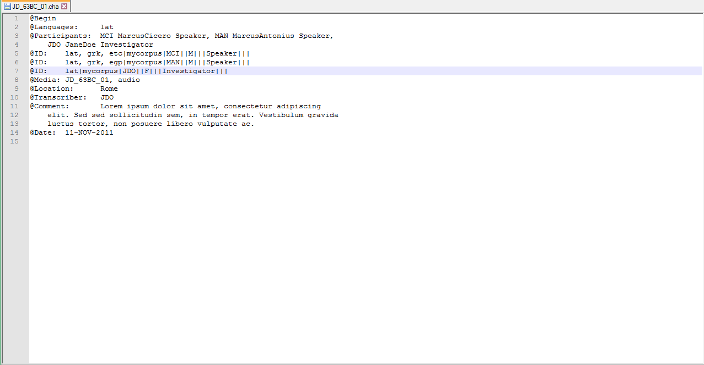

# excel2cha CLAN header generator

author: Jonathon Taufatofua
date: 2017-09-19

tags:
    - CLAN
    - Excel
    - metadata

categories:
    - Scripts

Metadata is "data about data". Recording metadata is important for linguistic field work. When documenting language, the metadata contains information such as location, time, participant information, recording format, media filenames, etc. Metadata can provide information about the social context of a documentation activity and provide a locator for a resource once it enters a larger collection. 

<!--more-->

However, it can be a burden to create and use metadata! There are many 'standard' forms of metadata, many ways to create and store metadata, and each linguist has their own preferred method. 
 
Some transcription software requires particular metadata to associate the transcription with a media file.
 
This script was developed to copy data from a spreadsheet into the header fields of a CLAN transcription, so that a linguist wouldn't need to input the data twice. This small step is significant in reducing the amount of work required when beginning transcribing.

## Download

Download the script from 
[github.com/CoEDL/clan-helpers](https://github.com/CoEDL/clan-helpers)

## Screenshots

Example spreadsheet with metadata:

And here's how it ends up in CLAN:

## Instructions

The script requires the session information (time/location/participants...etc) in one Excel sheet as well as a second sheet in the same workbook, listing the participant IDs for CLAN. It relies on a particular format of the data (they must be separable into CLAN header-like columns so its just pick and place rather than chopping and changing). Currently it needs an exact column ordering but it could be modified for a more general case.

More steps coming soon...
