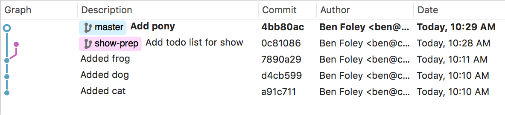

# Introduction to Git

author: Ben Foley, Nay San
date: 2017-09-23
updated: 2017-10-06

tags:
    - Git
    - Version Control

categories:
    - Tutorials

This is a beginner's guide to using Git version control with the SourceTree program. 

<!--more-->

### Contents

+ [What is git?](#what-is-git)
+ [Why use version control?](#why-use-version-control)
+ [What does it look like?](#what-does-it-look-like)
+ [How do we use git?](#how-do-we-use-git)
+ [Real-life linguist workflows](#real-life-linguist-workflows)
+ [Hands on](#hands-on)  
  + [Getting set up](#getting-set-up)
  + [Software](#software)
  + [A sandbox](#a-sandbox)
  + [First commit](#first-commit)
  + [History](#history)
  + [Let's branch](#let-s-branch)
  + [Remotes](#remotes)
  + [Protecting branches](#protecting-branches)
  + [Dealing with merge conflicts](#dealing-with-merge-conflicts)
+ [Definitions/glossary](#definitions-glossary)
  + [More definitions](#more-definitions)
+ [Further reading](#further-reading)
    + [Stay tuned for more git workshops](#stay-tuned-for-more-git-workshops)

---

## What is git?

Git is a *version control* tool, a way to keep track of changes to files.

Think about MS Word's Track Changes, but it's so much better. It's also better than copying files into folders with dates (or folder names like "final", "final2", "last-changes").


## Why use version control?

Version control documents your changes to files, storing the date, time and author info as a "commit". When you save your changes you can describe the changes you made with a message. This version history is a valuable log, a reference which you can look back through to find the point at which data changed.

Version control gives you certainty about the state of your data, especially when collaborating. Using Git, you can compare the changes you make to your copy of data against what others have done to theirs.

When your changes have been committed, they stay in that state (you can come back to that point if you ever need and they will not have altered).

It's a great way to work collaboratively. Many people can work on a project, each person can have a local copy of the project and work on their local version without affecting other people's copies. This also makes it useful for offline work. If you have a copy of a Git project on your computer, no network is needed to access a history of the project's changes because all the history is stored within the project. You can edit the project while offline and syncronise later when you have online access.


## What does it look like?

A simple tree (or graph of commits) looks like this:

```graph

      [c]
       |
      [b]
       |
      [a]
  
```

A slightly more complex graph has branches:

```graph

      [f]
  [e]  |
     \ |
      [d]
       |  [c]
       | /
      [b]
       |
      [a]
  
```

Here's how graphs look in SourceTree (a visual Git editor).





Git commands either add nodes to the graph or navigate through the graph. The graph of commits within a project is called a repository. 

Git repositories can be stored on your local computer and remotely on a server like github.com, gitlab.com or bitbucket.com. 


## How do we use git?

The basic Git workflow goes something like this:

- **Pull** files from a remote repository.

- Work on the files locally.

- **Add** the changed files to a staging area.

- **Commit** the changes, which stores the changes.

- **Push** that commit to a remote repository.

We'll do these soon...


## Real-life linguist workflows

For a linguist working solo, a typical project might contain one remote repository, cloned to their computer. In this setup, it is common to only have one branch.

When collaborating, the setup will change depending on the degree of trust within the group. 

For small numbers of trusting collaborators, the remote repository should have a "protected master branch" which prevents people from pushing directly to that remote branch. Each approved contributor can clone the project to their computer and work on their own branch. When they want to share their work, a "pull request" or "merge request" is made to bring the changes from their branch into the remote's master branch. The request can check whether there are conflicts in what has been changed which need to be resolved before merging happens. This helps with avoiding breaking other people's work.

For larger (especially public) groups, the remote repository is forked by each contributor. They then clone their remote locally, work locally and push back to their remote. Pull/merge requests can still be made from their forked repository to the original repository, to bring their work back into the original.

---

## Hands on 

### Getting set up


#### Software

For the rest of this guide, we'll use SourceTree to work with the Git repository, and VS Code to edit files.

1. Install SourceTree from [https://www.sourcetreeapp.com/](https://www.sourcetreeapp.com/).


    1.1 Click the download button.

    1.2. Open the downloaded file (EXE for Windows or DMG for Mac).

    1.3. You need an Atlassian account to use SourceTree. If you have one already. click *Use an existing account*. To create an account, click *Go to My Atlassian* and follow the prompts to create a new account.

    1.4. If/when SourceTree says that it cannot find an installation of Git, click the option to install an `Embedded version of Git`. We don't need Mercurial.

    1.5. Open SourceTree and go to Preferences. Enable the option to *Allow SourceTree to modify your global configuration files*. Then add your name and email address in the Default user information fields. Note that this information will be publicly available if you push commits to a public remote repository.

2. Get VS Code from [https://code.visualstudio.com/](https://code.visualstudio.com/)

  - If you do not have administrator/install access on your Windows machine, you should get the .zip file version of VS Code from [https://code.visualstudio.com/docs/?dv=winzip](https://code.visualstudio.com/docs/?dv=winzip)


#### A sandbox

1. For today's play, make a folder somewhere easy to access, preferably without spaces in the path. For example (on mac), `~/Documents/learn-git`

2. Open SourceTree and go to `File > New/Clone > Add Existing Local Repository`. 

    2.1. Browse to the folder you just created. 

    2.2. SourceTree should prompt us to create a local repository. Click `Create`. This just initialised git version control for this folder!

    2.3. Double click the icon in the SourceTree repo list to open the main window for this repo. Nothing to see here yet though. Let's add some files.

3. Open the folder in Visual Studio. `File > Open` then select your `learn-git` folder.


### First commit

1. Let's add a file in the folder. Using VS Code, `File > New File` then name the new file `wordlist`. The file will open in the editor pane when it has been created. Type some words into the new file and save it.

2. Now, back to SourceTree. In the sidebar `Workspace > File status` we should see our new file. Git sees that the file is here but the change hasn't been staged yet. Over on the right-hand side, we see a "diff" of the file changes. 

3. Tick the checkbox next the filename in the `Unstaged files` area. This adds the file changes to the staging area, ready for a commit.

4. Now, compose a short, descriptive message in the Commit message box, something like `Add first words to wordlist`. And press the `Commit` button. 

5. Pat yourself on the back, your first change has been committed :-)

6. Let's repeat that, so we can see how `history` and `diff` work. 

7. Add some more words to the wordlist file. Save in VS Code, then stage (add) and commit in SourceTree.

8. Delete a word or two, save, add and commit.


### History

Now we have three commits in the repository. Looking at `Workspace > History` we can see a log of our changes. 


The **Graph** column shows the hierarchy of commits visually. 

**Description** holds the commit message. 

The **Commit** column has a unique ID for each commit. This is a "hash" of information about the commit. More on this later, for now it's enough to know that the ID is unique, and can be used to navigate through the repo history.

**Author** has the name and email address of the person who made the commit.

**Date** shows when the commit was made.

Select a commit to see which files were changed. Select a file from the bottom left panel to see the content changes in the bottom right Diff panel. Green lines prefixed by `+` indicate that the line was added. Red lines prefixed by `-` indicate the line was removed. The two columns of line numbers in the diff panel refer to the position of the change in the file before and after the change respectively.


### Let's branch

Branches are a handy way to organise your changes into logical groups. In software development, branches are often used to group changes according to the features they will bring to the project. The architecture of your repository's branches is referred to as a workflow. For corpus work, branches might help organise your changes according to particular processing activities. 

One of the great things about branches is that you can fiddle around with your changes without affecting other people's work in the same repo.

While it's good to have an understanding of branching, many projects are content with only one or two brances. See the [workflows](#real-life-linguist-workflows) section above for more information about different scenarios. 

We'll make our next lot of changes on a new branch.

1. In SourceTree, ensure that you have committed all of your current changes. It's best to branch from a "clean" state, where there are no uncommitted changes. Select the top-most commit and click the `Branch` icon. Name the branch (lowercase, no spaces, eg `process-words`) and click `Create Branch`. 

2. Making a new branch hasn't changed our files, we have just added a new reference into our tree. We can view all our branches in the sidebar's `Branches` item.

3. Edit the file in VS Code (do something like sort the contents), save, add and commit it.

4. Our `History` now shows that the `process-words` branch is ahead of the `master` branch. Let's move it ahead even further, with a series of changes. Change the file again, add and commit after each change. Do something like capitalise the words, add and commit, then insert blank lines between each word, add and commit again. Have a look at the `History` now, there should be a few commits difference between the two branches.

5. Now, say we're happy with our our wordlist. Time to "merge" our changes back into `master`. Check again that there are no uncommitted changes. Change to the master branch by double-clicking the `master` branch name in the sidebar, or right-click and choose "Checkout master". The name should go bold in the sidebar. Because we are now back to the snapshot when we diverged, the contents of the file are back how they were before you did the processing work! Merging will bring the changes made on the other branch into this one.

7. Click the `Merge` icon. In the merge window, change the left-option list to the name of the branch you want to bring in (`process-words`).

8. In the options below the file pane, tick `Create a commit even if merge resolved via fast-forward`. Click `OK` and *Voooom*, the changes in the source branch are merged into the target. The source branch can be deleted but the change history lives on.


### Remotes

To benefit from using Git as a collaboration tool, a copy of the repository needs to be accessible online. These remote repositories are typically hosted on github.com or gitlab.com. 

Remote repositories can be cloned locally, and changes can be pushed and pulled to/from the remote. Remotes can also be "forked", copied to another remote location.


1. First, register an account at a [gitlab.com](https://gitlab.com/users/sign_in). Make sure you use the same email address that you used in the SourceTree preferences. This will authenticate you for pushing and pulling at GitLab.

    1.1 Verify your email if required, then sign in. 

    1.2. Create a `new project` on gitlab.com. Name it `learn-git-collab`. Make it public so that SourceTree can access it. You can have private repositories, but it takes a little more effort to set up authentication for SourceTree to access them.

2. Create a working copy of a remote repository by `File > New/Clone` and choose `Clone from URL`. 

	Source URL: Get this from your remote repo's HTTPS field on the overview page.  
	Destination Path: Select the folder which contains `learn-git`.
	
3. Click `Clone` to download the remote repository.

    The folder structure on your computer should now look like this, with the newly cloned repo next to the one we were working with earlier: 
        
        ```	
            ├── learn-git
            │   └── wordlist
            │
            └── learn-git-collab
        ```
        
4. After cloning, SourceTree will open a window for the repository. Now the REMOTES sidebar menu has a new item "origin".

5. The change/commit process is the same as before, so make some changes, add and commit them.

6. After commiting, we see our local branch (master) advance, but the origin references (origin/master) are still on the original commit.

7. Anything you commit will update your local repository, but won't change the remote until you push.

8. Now, try pushing your local changes to the remote. Click the Push button, and in the popup window, tick Push and OK. If you have multiple local or remote branches, you can choose what to push where from this window.

9. After the push has happened, refresh the gitlab.com window to see that the files you added have been pushed to the remote repository.


### Protecting branches

Writing directly to a remote's master branch is convenient, but in a collaborative project you might want more control over who can write to particular branches. A common workflow is to protect the master branch from pushes and require people to make changes on their own branches. These user-created branches can be pushed back to the remote repository and used to create a merge request (aka pull request). Merge requests are then checked and the changes can be merged into master or discarded by people with appropriate access permission.

For more information about setting up a protected branch with GitLab, [see the docs](https://docs.gitlab.com/ee/user/project/protected_branches.html#protected-branches). 

To submit a merge requet to a protected branch:

1. Clone the remote repo to your local computer as before.

2. Make a new branch.

3. Make your changes and commit.

4. Push just the new branch to the remote; in the Push options, choose the local branch that has the work as the source.

5. Once the push has completed, go to the GitLab project's `Repository > Branches` page. 

6. Make a merge request from your work branch by clicking the `Merge request` button. From this page you can also compare the files in the commit.

7. Fill out enough details in the `New Merge Request` form to inform the reviewer what the commit does. You can assign it to a particular person (they'll get a notification when the request is made), and create labels that will help organise the request (useful if you have lots of requests open). Check that the souce and target branches are as you expect. Source should be the branch that you pushed, target is usually `master`. To keep the repo clean, tick the option to `Remove source branch when merge request is accepted`.
And you can also tick `Squash commits when merge request is accepted` to combine all the individual commit messages from the source branch into one.

8. Then click the `Submit merge request` button to create the request.

9. Now there's a merge request, anyone can comment, not just the assignee.

10. Someone with merge permissions can now view the request and merge it. If there's a conflict, the reviewer might amend the commit or send it back to the submitter with a comment to fix the changes.
If there are corrections to be made, make sure to push the changes to the same branch.


### Dealing with merge conflicts

Let's pair up for this activity.

1. Create an account on gitlab.com.

2. Person A from each pair:

    2.1. After signing in to gitlab.com, click the `New Project` button. Choose `Blank` as the template. Give it a name. Make it public. Click `Create project`.
    
    2.2. Add the other person as a contributor in `Settings > Members`. Search for your partner by the email address of their gitlab account, set their role permission to `developer` then `Add to project`.
    
    2.3. Clone the repo and open it in VS Code.

    2.4. Create a new file.

    2.5. Commit and push in SourceTree.

3. Person B, once the first commit is showing in the remote: clone the repo.

4. Working simultaneously now... Both:

    4.1. Make a new branch. 

    4.2. Edit the file. Commit it. 
    
    4.3. At this point, you should have differing content! When we push and attempt to merge, the first one we do will work, the second will have a conflict. 

5. Both: push your branch to the remote and create a Merge Request from it.

6. One person, 

    6.1. Approve one of the merge requests. 

    6.2. When it has merged, attempt the other. *Eeeeek*, there are merge conflicts! When there's a conflict, a merge request can't be merged without manual intervention. Let's look at how to resolve the conflicts. 

    6.3. Click the `Resolve conflicts` button to open a diff page [1], showing the conflict sections in the conflicting files. Conflicts are labelled as "ours" (the source) or "theirs" (the target).

    6.4. You can choose to keep one or the other by clicking the corresponding `Use ...` button. 
    
    6.5. Or you can combine the changes manually, by clicking the `Edit inline` button.
    
    Files with conflicts are shown with `<<<<<<<`, `=======` and `>>>>>>>` symbols wrapping the conflicting chunks. Edit the file, removing those symbols and manually fix the text to suit what should be saved.
    
    6.6. Write a message describing the commit resolution and click `Commit conflict resolution`.
    
    6.7. Once the commit has been made, the merge request page should get a big blue banner on it. Wait a moment for the status message to update (should say something about HEAD recently changing). Reload the page at this point to make the Merge button active. 
    
    6.8. Click the merge button to process the merge.
  
7. Done! The branches will be removed automatically.

8. Both: now update your local repository with the remote changes by doing a `Pull`.
  


[1] The web interface may not work on large files! In which case, try resolving conflicts locally (guide tbc).


---

## Definitions/glossary

**Add**  
Writes changes to a staging area. 

**Branch**  
A branch is a parallel version of a repository. It is contained within the repository, but does not affect the primary or master branch allowing you to work freely without disrupting the "live" version. When you've made the changes you want to make, you can merge your branch back into the master branch to publish your changes.

**Commit**  
A commit is an individual change to a file or set of files. It's like when you save a file, except with Git, every time you commit you save information about who made the change, what was changed, and when. Each commit gets a unique ID that can be used to navigate through the repository's history.

**Diff**  
A diff is the *difference* in changes between two commits, or saved changes. The diff will visually describe what was added or removed from a file since its last commit.

**Fetch**   
Update your local repo with status of the remote. Fetch only downloads new data from a remote repository - but it doesn't integrate any of this new data into your working files.
[Read more about the difference between fetch and pull](https://www.git-tower.com/learn/git/faq/difference-between-git-fetch-git-pull)

**Git**  
Version control system for tracking changes in files.

**Head**  
A symbolic reference to the current checked out branch. 

**Index**  
The area where file changes are added when staging. Also known as the *staging area*.

**Merge**  
Combine the changes from one branch into another.

**Pull**  
Pull is similar to doing fetch-and-merge. It tries to merge remote changes with your local ones. Avoid pulling when you have uncommitted local changes.

**Push**  
Send your local changes to a remote repository.

**Staging**  
Preparing and organising a commit.

**Version control**  
A system that saves the history of changes to files.


## More definitions

- [More definitions from GitHub](https://help.github.com/articles/github-glossary)

- [Git FAQs from GitTower](https://www.git-tower.com/learn/git/faq)


## Further reading

[The seven rules of a great Git commit message](https://chris.beams.io/posts/git-commit/)

Comparing Git Workflows:

- [Centralized Workflow](https://www.atlassian.com/git/tutorials/comparing-workflows#centralized-workflow)
- [Feature Branch Workflow](https://www.atlassian.com/git/tutorials/comparing-workflows#feature-branch-workflow)
- [Gitflow Workflow](https://www.atlassian.com/git/tutorials/comparing-workflows#gitflow-workflow)
- [Forking Workflow](https://www.atlassian.com/git/tutorials/comparing-workflows#forking-workflow)


## Stay tuned for more git workshops

Coming soon:

- Setting up SSH for working with private repositories
- Differences when working with GitHub
- Working with large files
- Resetting/reverting and other git-fu

