# The CoEDL corpus platform

author: Tom Honeyman
date: 2017-10-05

tags:
    - ANNIS
    - corpora
    - transcripts

CoEDL has a "proof-of-concept" corpus platform, currently restricted to corpus contributors. This is a project aimed at making textual materials more readily available to researchers.

This is a basic guide to the platform.
<!--more-->

## CoEDL corpus platform

The [preliminary corpus platform](http://go.coedl.net/corpora) is available, but currently limited to those with a password.

[ANNIS](http://corpus-tools.org/annis) is an open source corpus platform. A generic user guide is [available](http://corpus-tools.org/annis/documentation.html), while this is a simple guide to just the features available within the CoEDL version.

## Entering the corpus platform

The corpus platform can be accessed at [http://go.coedl.net/corpora](http://go.coedl.net/corpora). Currently access is limited to contributors, via a password. Click on the 'Login'  button located on the top-right corner of the main page, and then enter your username and password to continue:

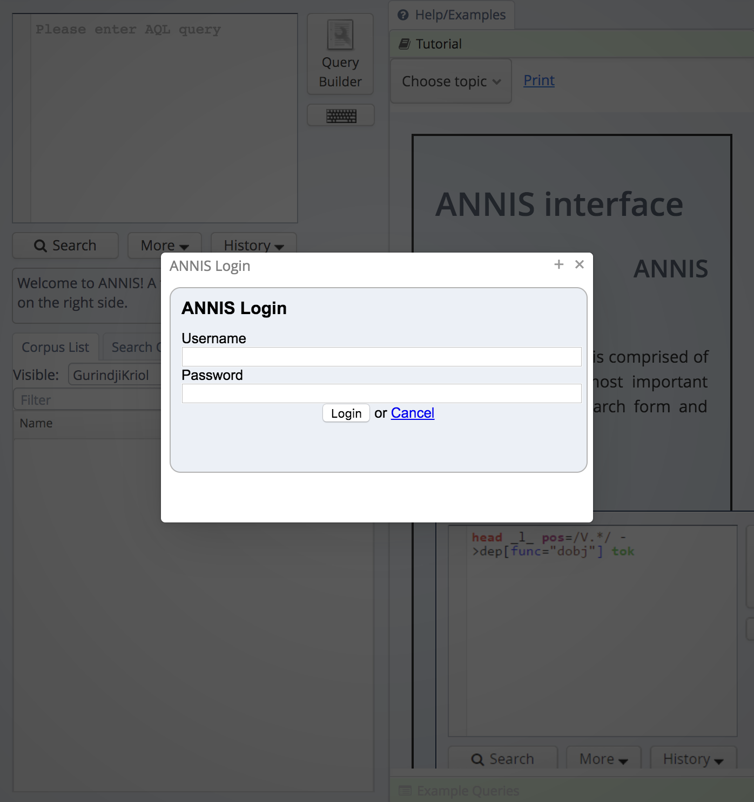

The main page looks like this:

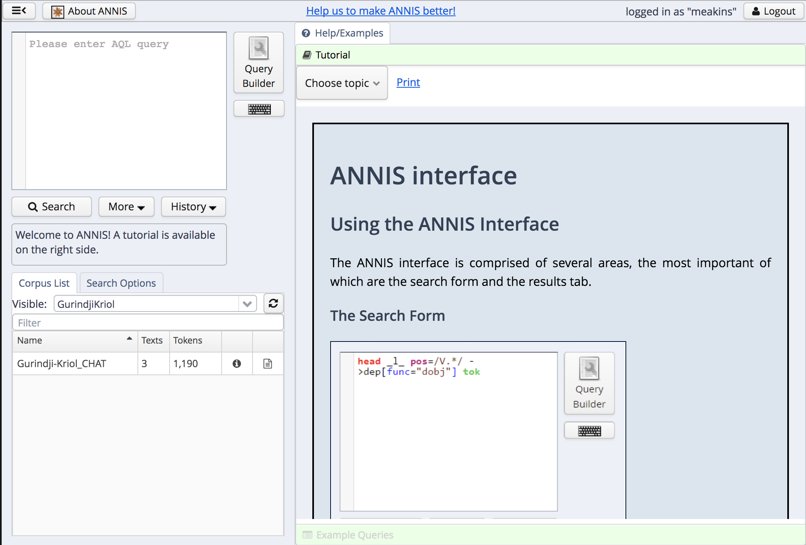

Note the logout button in the top right.

## The basic layout

The page is made up of three components: the query panel and corpus list on the left and the results page(s) on the right.

To begin with, the query panel will be empty:

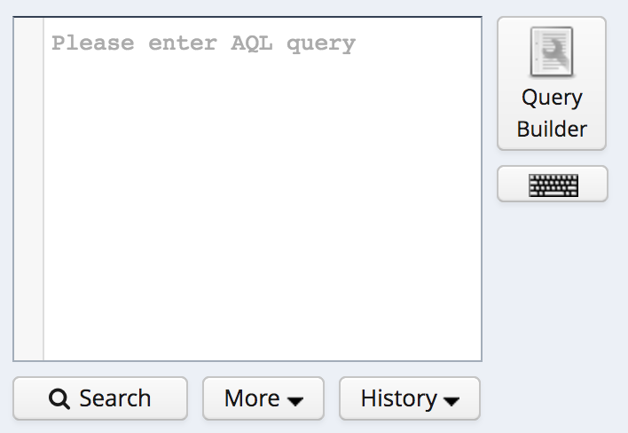

The (sub-)corpus panel will list one or more sub-corpora:

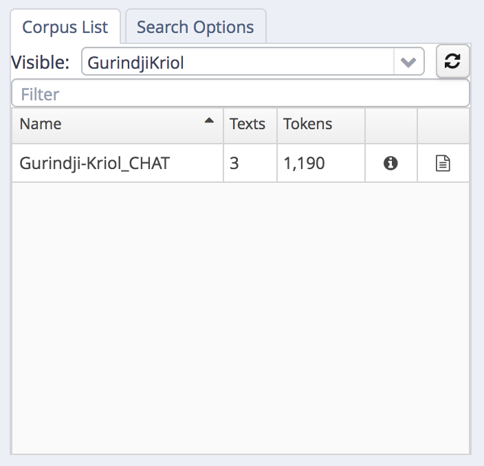

The "Visible:" drop down menu filters the sub-corpus list:

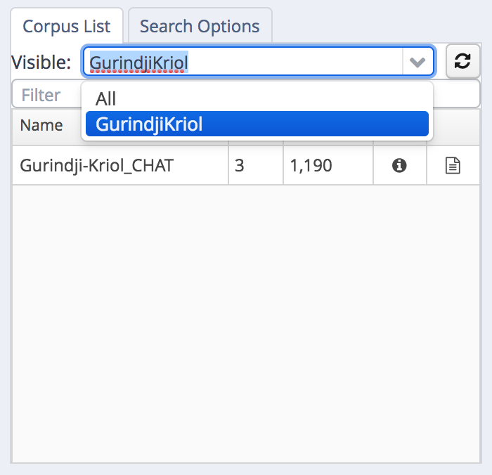

Corpus contributors can browse other corpora (which is encouraged, so you can see what other types of annotations others are contibuting). View all available corpora by choosing "All":

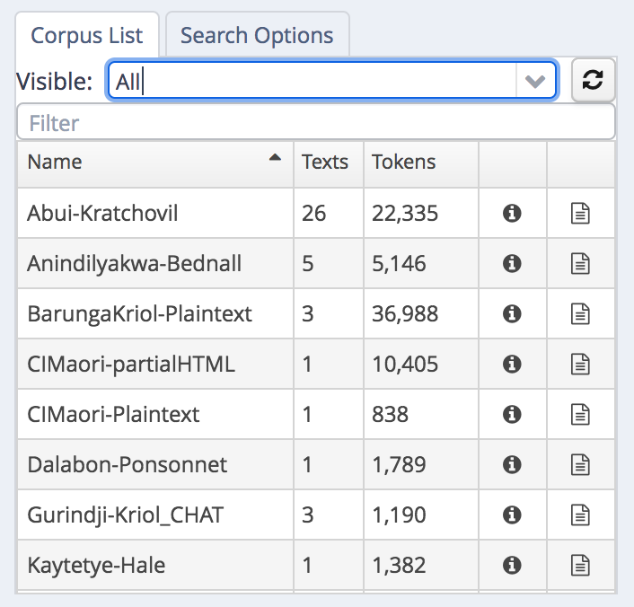

## Searching

To search the corpora, select one or more subcorpora in the list. In the example, we are searching in the Gurindji-Kriol corpus:

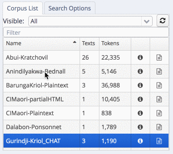

### Searching words/tokens

Every single corpus has a baseline layer called "tok" (for "token"). This is usually a word level representation of the primary text. It is the default layer to search on, and so a basic query can be either a search for a word (in quotes):

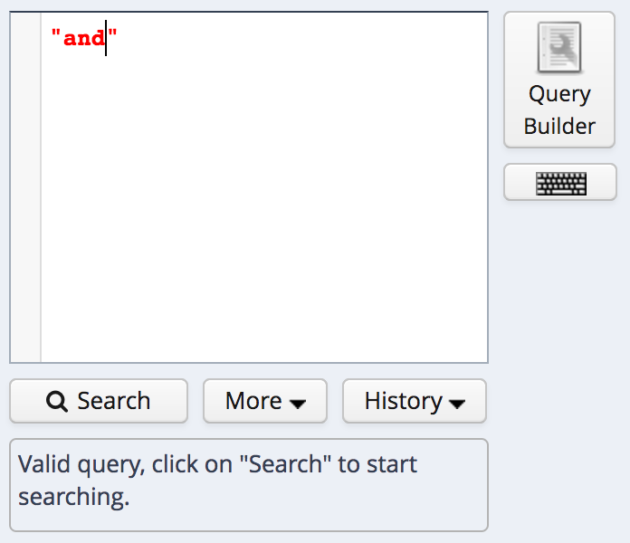

Or a regular expression between forward slashes (//):

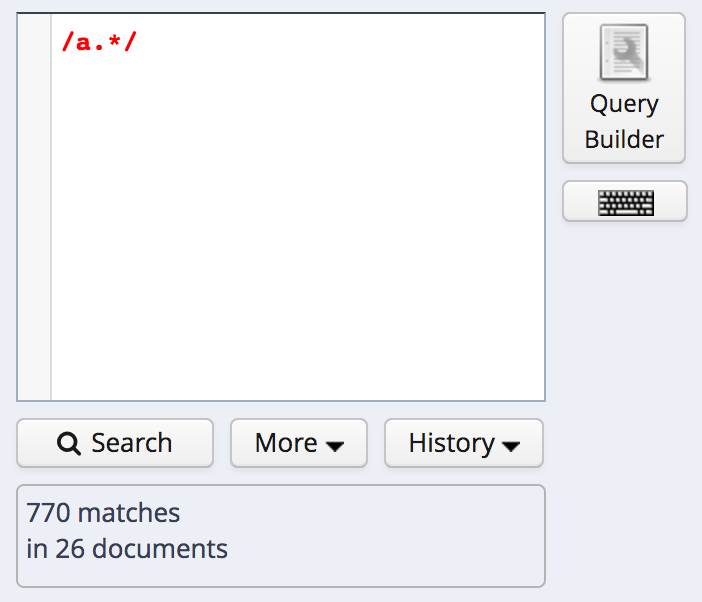

More complex searches can be built with the query builder. This is a good way to learn the full syntax of the annis query language (AQL). 

### Query builder

The easiest way to build a complex search is to use the query builder in the top left. Click on "query builder":

After clicking "initialise", we can begin to construct a query.

Queries can be sequences of one or more "tokens" (i.e., annotations on a specific layer or tier). They can fall under the scope of a "span" (e.g., limited to a specific speaker). Metadata for a file can also be used to constrain the search.

In order to fall under the scope of a span, these spans must first exist in the corpus. Not all corpora have these spans. If you provided segmented text (e.g., utterances) with extra information like speaker turns or translations, then you should have annotations for these categories of information. Spans can be any grouping that interests you. For instance, spans of reported speech, of syntactic units, or of any other grouping that may be of interest to you.

#### Linguistic sequences

Begin by choosing the "word sequences and meta information" search, and then clicking "initialise". Then add an element/token to a linguistic sequence. First choose which layer you want to match:

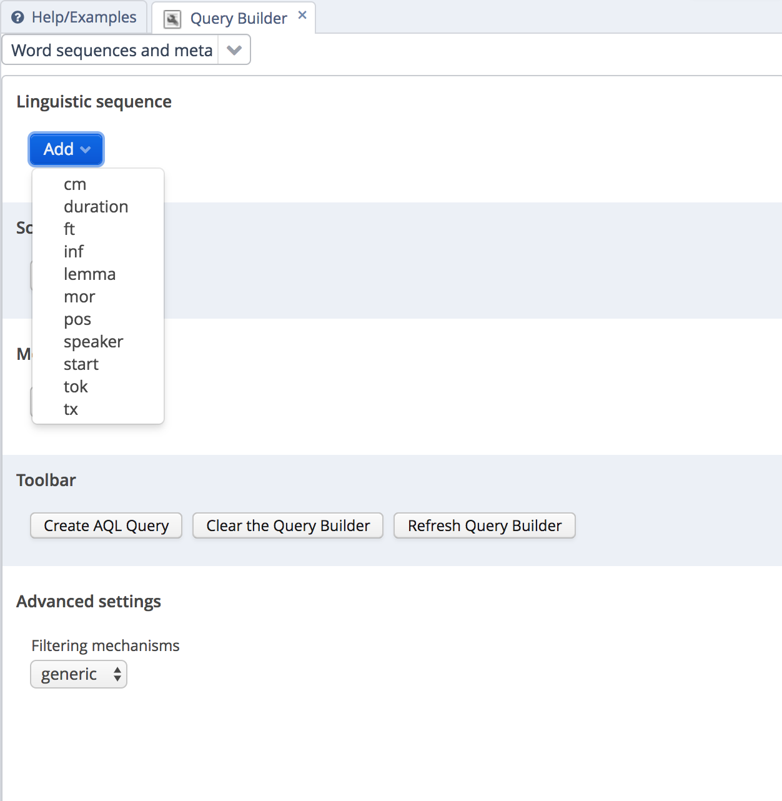

If you choose the default "tok" layer, then you type in a word/token that you'd like to match. Regular expressions can be used, but note that the regular expression must match the whole token, not part of the token.

For any other layer, a list of possible values will appear.

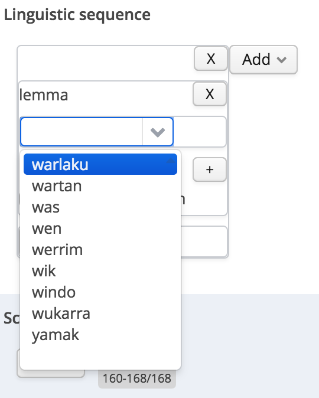

If you want to match more than one form, add a second token to match against:

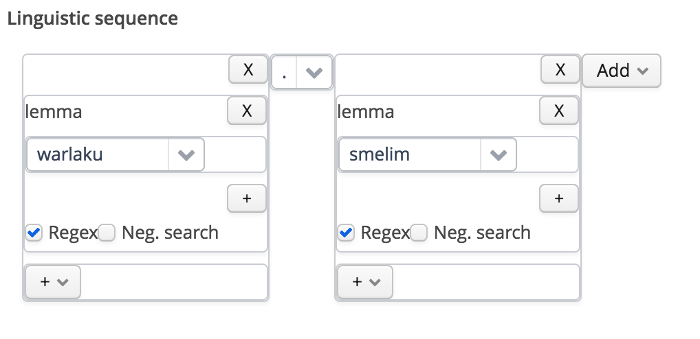

Here we are matching on the same layer, but it is possible to match adjaceny on a different layer too.

In between the two, choose the kind of adjacency relationship:

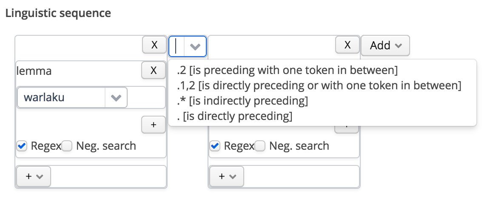

#### Scope

If there are layers defining useful spans which tokens fall under, results can be limited to a specific scope.

First choose the relevant layer:

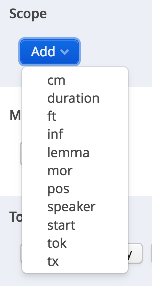

And choose a value:

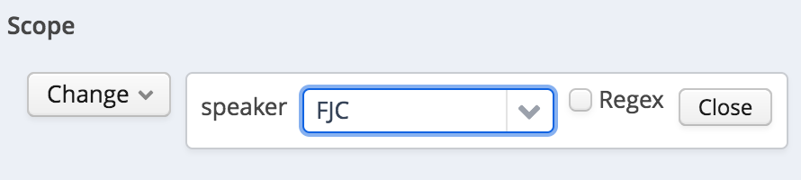

#### Metadata

Results can be limited to specific metadata values. In the same way, add a relevant metadata label, and choose relevant values:

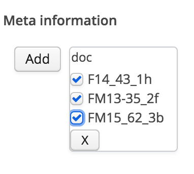

### Compile the search

Once you are happy with the search criteria, click "Create AQL Query"

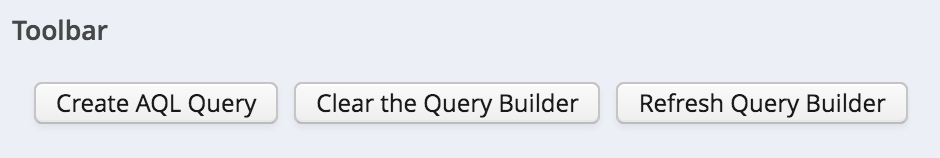

The query is translated into a search in the query box. Click search to search for values:

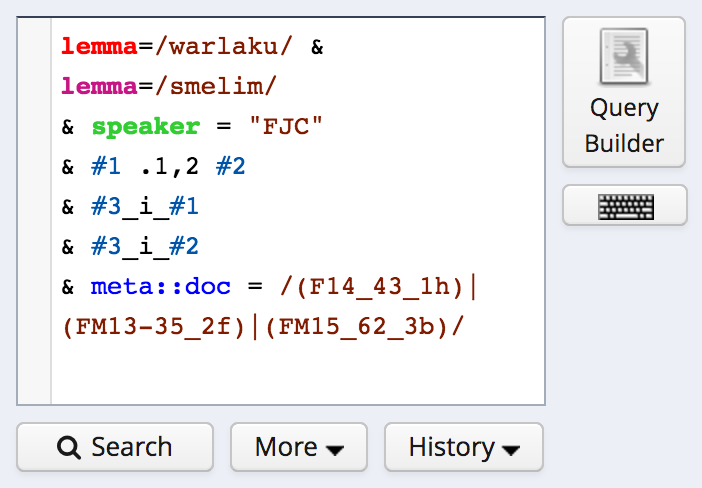

## Search Results

Search results are shown in the panel on the right of the page:

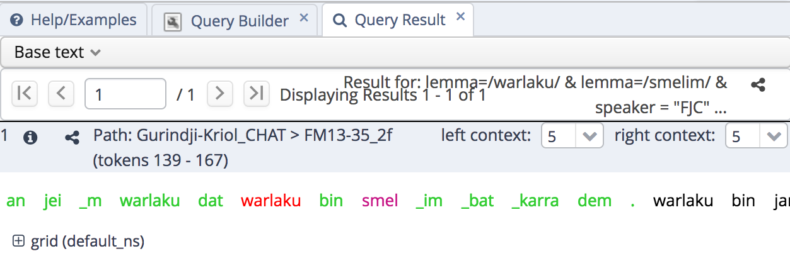

Document metadata for the result can be displayed by clicking on the (i):

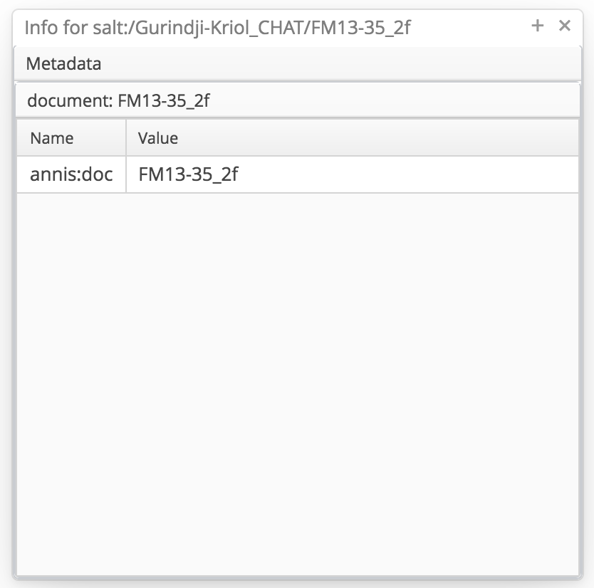 

By default, the baseline text is shown. By clicking on "grid", a layered display of the corpus is shown instead:

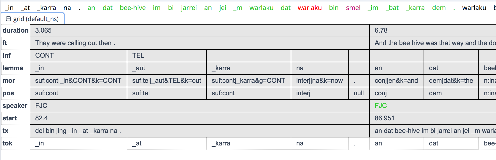

## Document browser

A basic document browser is implemented for each of the corpora. At present the display of the text is fairly basic, but will be improved upon soon.

View the document listing for a given corpus by clicking on the documents/files icon next to the sub-corpus name.

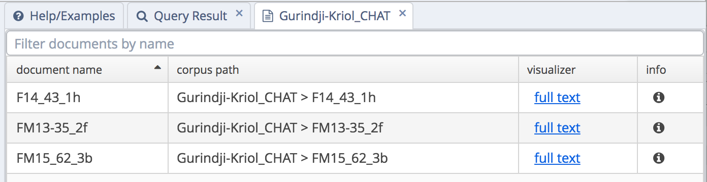

Click on "full text" to view each individual text.

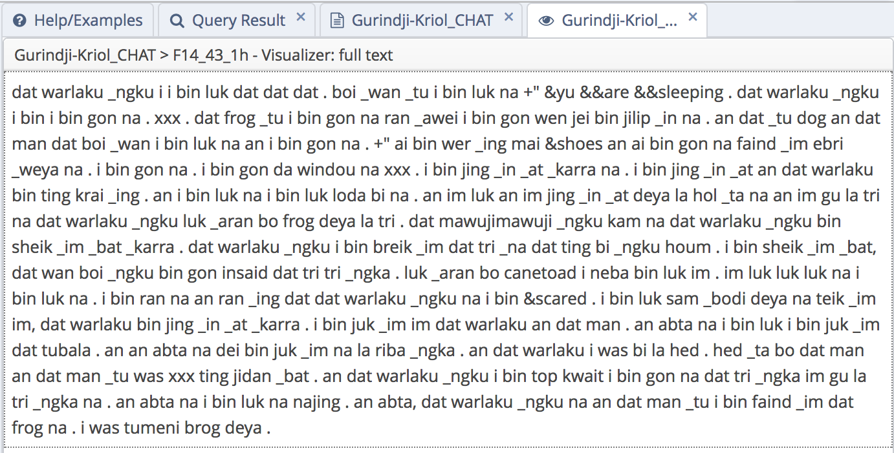