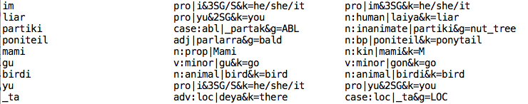

# Introduction

In this post, I'll introduce 8 (yes, eight) scripts for cleaning up the %mor tier in a CLAN corpus. Fair warning: this post is pretty technical and very long. But if you want a squeaky clean CLAN corpus, you've come to the right place.

All these scripts have all been developed for the specific needs of the Gurindji Kriol corpus, and as such might need to be tweaked slightly to suit your needs. If you think these might be helpful for you but you need some help running them or making minor changes, I'm more than happy to help.

You can download all scripts [here](https://gitlab.com/swilmoth/CLAN-Scripts), except for splitFiles.py and morChecker.py which are [here](https://gitlab.com/swilmoth/morChecker-and-splitFiles/). All are written in Python 2.7, for use on a Mac. With the exception of morChecker.py which can be run at any point, I highly recommend following the order of scripts given in this post.

|Script|Description|Input|Output|
| --- | --- | --- | --- |
| morChecker.py | Finds anomalous mor-codes with comparable contexts (of a user-determined length) in a corpus|Corpus location|Table (copy into a spreadsheet)
| validateMorCodes.py | Checks that the mor-codes in a corpus all look okay according to your lexicon(s)|Lexicon(s), corpus location|2-column file for correction
| correctMorCodes.py | Fixes any known mor-code errors, based on the output of the above.|Corpus location OR giant text file with entire corpus, 2-column file with corrections|New versions of any corrected .cha files
| countTokens.py | Reports instances where there's a different number of tokens on the transcription tier and on the mor tier.|Giant text file with entire corpus|Table (copy into a spreadsheet)
| checkMorcodeMatches.py|Checks that the mor-codes actually correspond to the transcription.|Lexicon(s), giant text file with entire corpus|3-column file for correction
| correctMismatches.py|Fixes known mis-matches, based on the output of the above.|Giant text file with entire corpus, 3-column file with corrections|Giant text file with entire corpus (corrected)
| insertPlaceholders.py|Adds missing tokens to the mor tier that aren't added by CLAN's MOR command ('xxx', foreign words, etc)|Giant text file with entire corpus, 3-column file with corrections|Giant text file with entire corpus (corrected)
| splitFiles.py|Splits up that giant text file and puts the files back into place|Giant text file with entire corpus|Individual files!

## About that giant text file...
Some things are easier to fix when you just have one file open, instead of trying to manage hundreds in various locations. At different stages of this process, I've been joining all the .cha files into one text file, and splitting them back up again. I join them all together using grep:
```
grep '' */*.cha */*/*.cha > ALLFILES
```

Running this command from the top directory of my corpus joins together all the .cha files (in 1 or 2 nested subdirectories). It keeps the relative path of each file at the start of each line, like this:


I know it looks a bit crazy, but I promise works! See **splitFiles.py** for details on how to split this back up again.

Note: the file shown in the screenshot would have used a different command, like `grep '' ../../GurindjiKriol/Old/*/*.cha`

# morChecker.py

## Description

Disambiguating homographs on the mor tier is a pain. You can easily introduce heaps of errors, but it's almost impossible to find them. This script (by Simon Hammond), checks the consistency of mor-coding in similar contexts, to find errors such as a verb being coded as intransitive when it is followed by a transitive suffix (to mention a more straightforward example). This script looks at the mor-tier, and finds sequences of mor-codes of any given length, in which the forms are identical, but other information in the mor-codes differs. I run this script over all new data with different chosen lengths, and sort the output by frequency to find likely errors. The following table shows a small, selected excerpt of the output when searching for 4-grams:

|Total freq|Phrase|Lemma|POS 1|Freq 1|POS 2|Freq 2|POS 3|Freq 3|
| --- | --- | --- | --- | --- | --- | --- | --- | --- |
|120|START en dat ting|ting|n|118|interj|2|||
|74|i bin jak \_im|jak|v:tran|68|v:intran|6|||
|20|dei bin gu ged \_im|gu|v:intran|1|v:minor|19|||
|19|dei bin gu hant|gu|v:intran|1|v:minor|18|||
|35|dei bin ting na|ting|n|1|v|34|||
|19|i bin ran \_wei|_wei|der:nom|2|suf:tel|17|||
|15|bin meik \_im _bat|meik|v:tran|11|v:intran|2|v:minor|2|


This table tells us the total frequency of the particular sequence in question. The beginning and end of an utterance are also treated as parts of the sequence, as this may be salient information. It also tells us which item has been found with inconsistent mor-coding. Then, it tells us the POS information of each different mor-code found for that form, and how often each mor-code occurs. There are also extra columns that show the full mor-code sequence, so we can spot other inconsistencies (such as when the English gloss differs but the POS is the same). Going through this list:

  - *ting* in *dat ting* should always be coded as ‘n’ not ‘interj’, due to the article *dat*.
  - *jak* in *jak \_im* should always be coded as ‘v:tran’, because of the transitive suffix *_im*
  - *gu* in *gu ged \_im* should always be ‘v:minor’.
  - Likewise for *gu hant*
  - *ting* in *bin ting* should always be ‘v’, not ‘n’, due to the past tense *bin*
  - *\_wei* in *ran \_wei* should always be ‘suf:tel’
  - *meik* in *meik \_im _bat* should never be ‘v:intran’. It could be either ‘v:tran’ or ‘v:minor’ depending on the context - we might like to check this.

Based on this, we can make a list of automated fixes to make across the whole corpus, or search for particular examples that seem strange. 

This process will not catch every coding error, but it goes a long way and gives a good overview of the data. For best results, I run the script several times with shorter n-gram lengths each time. Searching for shorter n-grams results in an overwhelming output, in which the majority of inconsistencies are legitimate differences. This is still the case for most of the 4-grams identified, but it’s possible to look through them and find likely errors. Searching for longer n-grams gives a better signal-to-noise ratio in the output (i.e. inconsistencies found when searching for 10-grams are much more likely to be errors), but a much smaller output.

## Limitations
One limitation of this script is that it only looks at the citation form in the mor-code, and not the actual form that has been transcribed. Therefore, it won’t detect errors where *garra* was inconsistently coded as prep|garram&ASS&k=PROP when it should have been v:aux|garra&k=have, as the two citation forms are different. It does have one exception built in: the ergative and dative suffixes are treated as identical. They have two homophonous allomorphs (*\_ngku* and *\_tu*), but their citation forms are *\_tu* and *\_ku* respectively, so would not be found by the script. This exception was included because the changing case system is of particular interest and they are easily mis-coded. A future version of this script could take into account the transcription tier, and would be run after all these other cleaning up scripts are run.

## Instructions
The arguments of this script are: the location of the .cha files, and the desired length of the n-gram (if no length is given, the default is 4). The script compares any files with a .cha extension in all subdirectories.

```
morChecker.py /path/to/your/corpus/ -n [a number of your choice]
```

There's also an option for a simpler output (add `-s` to your command), which just prints POS information and not the full codes.

# validateMorCodes.py
This script is pretty simple - it checks that all the mor codes in your corpus are valid according to your lexicon(s). It ignores things that aren't in the lexicon, like punctuation and proper nouns. The script outputs a two-column file - you can correct the second column and automatically fix the corpus with correctMorCodes.py (below). If you've used this script before and already have a list of known incorrect mor-codes, use the `-c` option to ignore them. The lexicons should be in the .cut format, which looks like this:

```
@UTF8
_abat {[scat suf:tel]} "_abat&k" =about=
_abta {[scat suf:tel]} "_abta&k" =after=
_alang {[scat suf:tel]} "_alang&k" =along=
_am {[scat suf]} "_im&k" =TR=
_an {[scat suf:tel]} "_an&k" =on=
_ap {[scat suf:tel]} "_ap&k" =up=
...
```

The options of the script are:

```
-h   help message
-l   any number of .cut lexicons
-c   checked codes that you want to ignore (optional)
-d   directory containing .cha files (it will search in all subdirectories)
```

So my command is:

```
validateMorCodes.py -l lex_gurindji.cut lex_kriol.cut -c checkedMorCodes.txt -d /path/to/my/corpus 
```
The output is a two-column (tab-delimited) file. Here's a snippet of mine - I've corrected the second column according to the current lexicon:

```
?|Wave-Hill                    n:prop|Wave-Hill
?|and                          conj|en&k=and
adv:loc|karlarra&g=from_west   adv:loc|karlarra&g=west
n:bp|blud&g=blood              n:bp|blud&k=blood
num|jarrwa&g=big_mob           n|jarrwa&g=big_mob
num|jintaku&g=one              n|jintaku&g=one
v:intran|yamak&g=slow          adv|yamak&g=slow
v:tran|basim&k=pass            v:tran|pajim&k=pass
v:tran|nok&k=hit_head          v:tran|nok&k=hit
...
```
This file then becomes the input for...

# correctMorCodes.py

This script is also really simple. Apart from the corrected two-column file, the script allows two input options: the location of your corpus, or a giant text file containing the entire corpus. The command is:

```
correctMorCodes.py -c CheckedCodes.txt -d /path/to/your/corpus/

OR

correctMorCodes.py -c CheckedCodes.txt -i EntireCorpus.txt > EntireCorpusCorrected.txt

```
If your input is a directory, the script outputs each corrected file individually, in the same location as the original, but with '.cha.correctmor' as the file extension. Make sure to compare the original and corrected files to check that it's working okay. Then, a command like this will automatically replace the old versions with the corrected versions (change the `*/*.correctmor` bit according to your file structure):

```
for oldname in */*.correctmor; do   newname=`echo $oldname | sed -e 's/\.correctmor//g'`;   mv "$oldname" "$newname"; done
```

If your input was a giant text file, the output is just a new giant text file with corrections. Make sure to compare the differences before you split this up!

# countTokens.py

In theory, the mor tier should have the same number of tokens as what's been transcribed. In practice, things go wrong all the time and checking this is a good way to find weird things you otherwise mightn't be able to find.

The input for this script is that giant text file. The output is a tab-delimited file which can be copied into Excel. It tells you the line-number and the number of missing mor-codes, so you can look it up yourself and fix it.


As you can see in the above picture, at line 78654, *pleibat* is transcribed as one word, but is coded as if it was *plei \_bat*, with a continuative suffix. On line 78683, the transitive suffix *\_im* is missing a code. At lines 78795 and 79083, the topic marker *_ma* is missing a code. And something has *really* gone wrong at line 78844 - there are 19 extra mor codes that were presumably deleted from the transcription.

Going through and correcting this is pretty laborious, but my morCodeLookup.py script (see previous post) speeds it up a bit.

The command to run this script is simple:

```
countTokens.py MyEntireCorpus.txt > missingTokens.txt
```
The script ignores certain stuff that we expect to be missing - e.g. *xxx* for unintelligible speech, things like *&=laugh* or *&foreign &words*, etc. If you've already run insertPlaceholders.py (see below) and want to run countTokens.py again, add a `-p` to the command.

# checkMorCodeMatches.py
After running the previous scripts, all the mor-codes match existing entries in the lexicon, and the transcription and mor tiers have the same amount of stuff on them. At this stage, we can check that every single token on the transcription tier actually matches up with its corresponding code. **Don't run this unless the output of countTokens.py is 0!**

The inputs for this script are the .cut lexicon(s) and that giant text file. This script also ignores tokens like *xxx*, *&=laugh*, etc. The command is:

```
checkMorcodeMatches.py -l MyLexicon.cut [optional_other_lexicons.cut] -i MyEntireCorpus.txt > mismatches.txt
```
The output is a 3-column tab-delimited file for correction. The first column is the token on the transcription tier. The second column is the corresponding mor-code that doesn't match the lexicon. The third column is a suggestion based on the lexicon. Go through this file carefully and correct the third column.


In the screenshot above, you can see some really minor differences (e.g. the lemma of *gu* should be *gon* when it's a minor verb), and some instances where the transcription was corrected but not the mor-code (someone must have heard *\_partak* at first, but changed that to *partiki* later). And some things that are just wrong, like *liar* has the mor-code for *yu*. This is actually a good way to find odd inconsistencies in the lexicon - fix any you find and run the script again. Once we're happy with the third column, we can correct these automatically with...

# correctMismatches.py

This script corrects those mismatches according to our 3-column file. The input must be that giant text file. The command is simple:

```
correctMismatches.py -i MyEntireCorpus.txt -m mismatches.txt > MyEntireCorpus_Corrected.txt
```
The script will **only** make corrections when that particular mismatch occurs. That is, adv:loc|deya&k=there will only be changed to case:loc|_ta&g=LOC when *\_ta* is the corresponding token on the transcription tier. It also ignores tokens like *xxx* and *&=laugh*.

Because this script relies on the connection between the two tiers, make sure you have completely cleaned up any errors found with countTokens.py.

# insertPlaceholders.py
So far, these scripts have been ignoring things that don't get added to the mor tier by CLAN, like *xxx*, *&=laugh*, *&foreign &words*, and *\[uncertain words\]*. But if we're converting to another format where the connection between each token on each tier needs to be explicit, or if we want to include them for the sake of accurate searching and analysis, then we need to include them on the mor tier.

It turns this:

```
*FFM:  LD &yu &gonna &eat _im &all &_ap &hey . 
%mor: n:prop|LD suf|_im&TR&k=TR .
```

into this:

```
*FFM:  LD &yu &gonna &eat _im &all &_ap &hey . 
%mor: n:prop|LD &yu &gonna &eat suf|_im&TR&k=TR &all &_ap &hey .
```
This is just an example to show how the script works - please excuse the mixed up English/Kriol spelling!

This script is super simple to run:

```
insertPlaceholders.py MyEntireCorpus.txt > MyEntireCorpus_placeholders.txt
```

To ensure that the script inserts these placeholder tokens in the right spot, **only** run this script after you have run countTokens.py and checkMorCodeMatches.py, and the output of both is 0.

# splitFiles.py

After running the above scripts, we can be confident that every single mor code in the entire corpus is up to date with the lexicon, matches every single morph that has been transcribed, and is as clean and consistent as we can possibly make it. We just need to split up that giant text file and put each file back into place.

This script was written by Simon Hammond and Stephanie Soh at Appen - CoEDL-affiliated people, you will need to request permission to use it.

This script has two options: you can just output all the files in one folder, or you can put them back in their original places. The latter will almost certainly overwrite whatever version is already there, so proceed with extreme caution.

To output all files into a single folder:

```
splitFiles.py MyEntireCorpus.txt -o /path/to/cleaned/up/corpus/
```
The `-o` part is optional - if you leave it out, the script defaults to the current directory.

To put them back in their original locations:

```
splitFiles.py MyEntireCorpus.txt --replace -o /path/to/relative/location/
```

You can use the `-o` option in combination with the `--replace` option if the paths in your giant text file are *relative* paths. Here's a screenshot of what that text file looks like again:


As you can see, the `../../` at the start indicates we ran the grep command from some other subdirectory, so I would either navigate to that directory, or refer to it with the `-o` option.

# Acknowledgements

All Gurindji Kriol data shown above has been collected by Felicity Meakins and Cassandra Algy. All scripts were written by me (Sasha Wilmoth), with the exception of morChecker.py (Simon Hammond) and splitFiles.py (Simon Hammond and Stephanie Soh). Many thanks for the support of Appen, in particular Simon Hammond and Jason Johnston for their help with Python.
