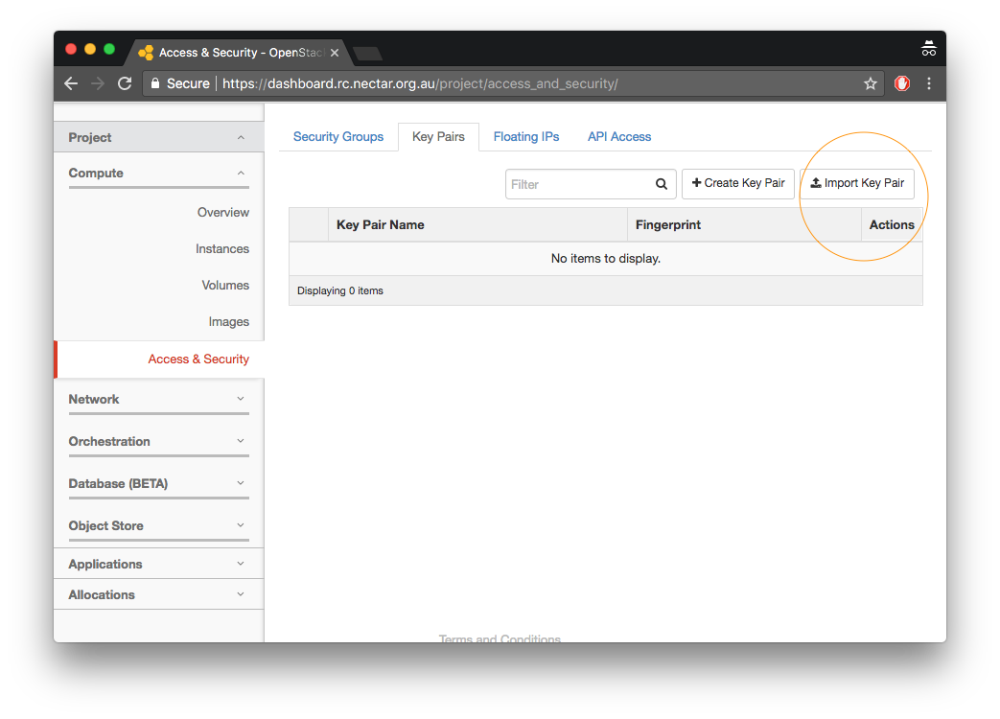
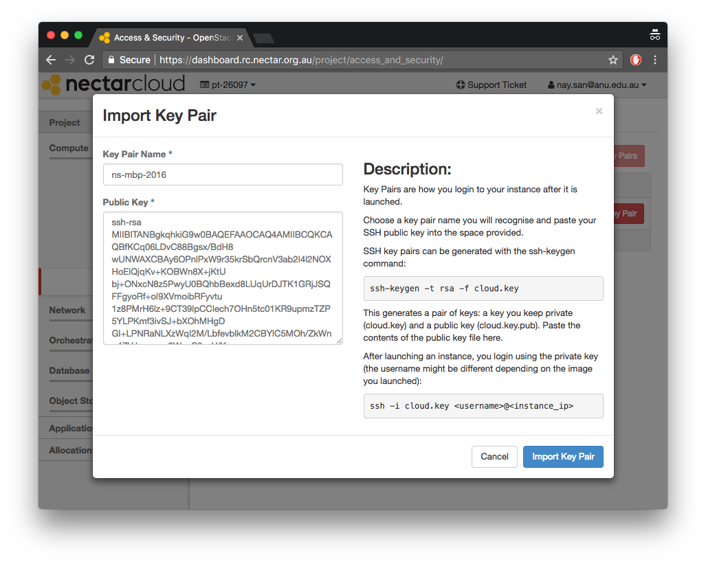
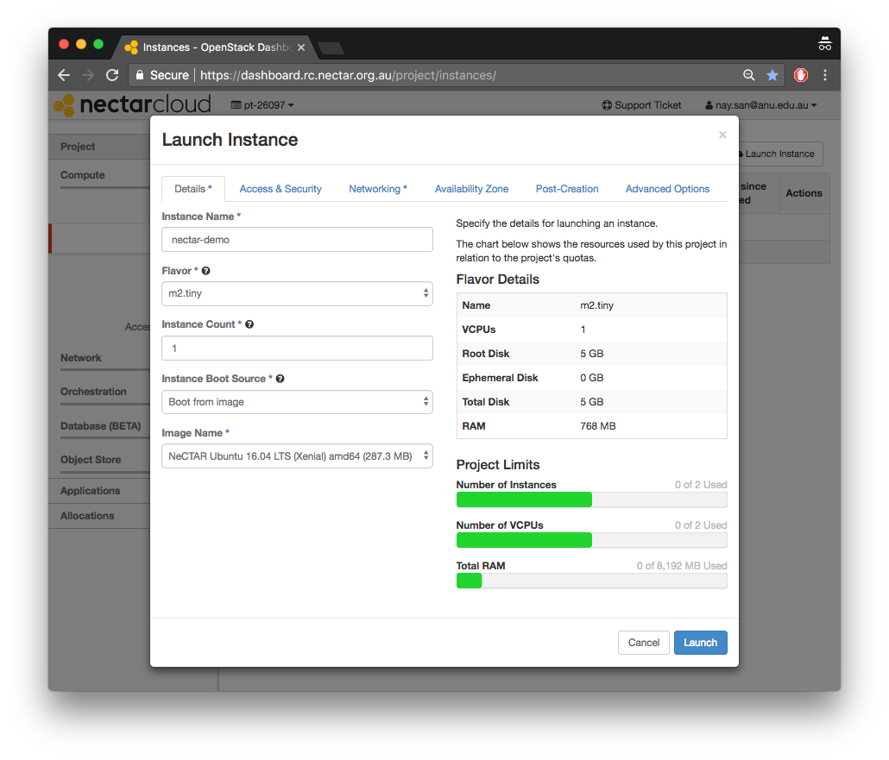
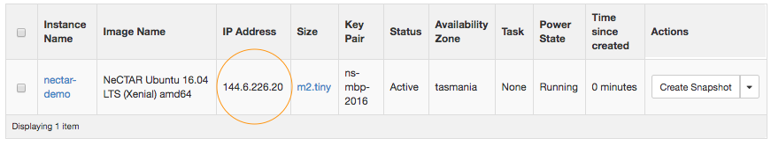
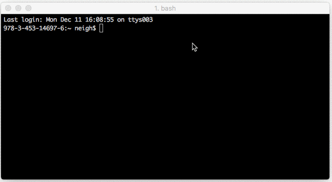

#  Set up Nectar

author: Nay San
date: 2017-12-11

tags:
    - Nectar
    - SSH
    - Setup

categories:
    - Tutorials

## Nectar setup

### About

The primary purpose of this tutorial is to be referred from other tutorials making use of the Nectar system. Here I give a quick introduction to:

1. logging into Nectar Dashboard for the first time
2. launching an instance on Nectar
3. logging into the *launched instance*

### 0. Have your SSH key ready

If you do not have an SSH key already generated for your computer, follow Step 1 of this guide: [https://kb.dynamicsoflanguage.edu.au/contribute/setup/](https://kb.dynamicsoflanguage.edu.au/contribute/setup/). The end of step 1 requires you to copy a generated public key ready for pasting elsewhere.

### 1. Log into Nectar and add SSH key

You can login and access the Nectar Dashboard by going to [https://dashboard.rc.nectar.org.au/](https://dashboard.rc.nectar.org.au/), and authorising yourself through your institution's credentials.

1. After logging in, go to the **Access and Security** page (left menu), and click **Import Key Pair** (top right):

	

2. Paste your copied **Public Key** from Step 0 into the text area for the public key, and give the key a meaningful name which identifies the computer you generated the key on (i.e. `ns-mbp-2016` is for my 2016 Macbook Pro).

	

You will only have to perform this step for every new computer from which you wish to access Nectar instances.

### 2. Launch Nectar instance, with SSH Security Group checked

1. Go to the **Instances** page (left menu), and click **Launch Instance** (top right).

2. Name and configure the instance. For this demo, just select one of the official Ubuntu images from Nectar (e.g. `NeCTAR Ubuntu 16.04 LTS (Xenial) amd64`):

	
	
3. Make sure you check `ssh` in the **Access & Security** tab of the Launch Instance window:

	
	**Note.** if you want to serve out web data from the instance, you should also check `http` (port 80).
	
### 3. Log into your launched instance, e.g. `nectar-demo`

After Step 2, you should see an active instance with an assigned IP address in your instances page:

In a Terminal window, type `ssh ubuntu@144.6.226.20`, where `144.6.226.20` is the IP address Nectar assigned to the launched instance (you will be asked whether you really want to connect when connecting for the first time, answer `yes`).

Once you've logged in, you'll notice that the prompt is of the form `ubuntu@nectar-demo` (i.e. `ubuntu` + `@` + name of instance), and not that of your local user/computer. Now you're ready to do things within the instance!
